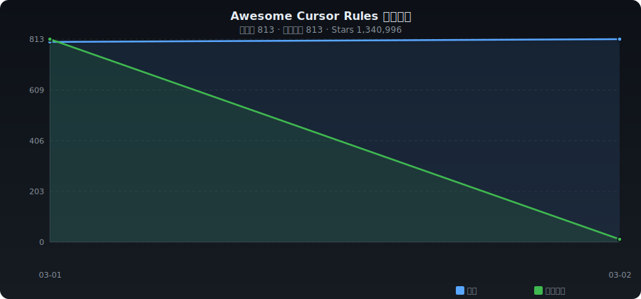

# ✨ Awesome Cursor Rules

[English](./README.md) | **中文**

> Cursor / Windsurf / IDE 规则与配置精选集合 —— 自动收录整理

   

---

## 📈 收录趋势

<p align="center"></p>

---

## 📊 分类统计

| 分类 | 数量 | 占比 |
|------|-----:|-----:|
| 📚 规则合集 | 150 | ██████ 18.7% |
| 🖥️ 前端开发 | 40 | █ 5.0% |
| ⚙️ 后端开发 | 118 | ████ 14.7% |
| 📱 移动端 | 8 | █ 1.0% |
| 🏗️ 全栈项目 | 22 | █ 2.7% |
| ☁️ DevOps & 基础设施 | 40 | █ 5.0% |
| 🤖 数据 & AI | 231 | █████████ 28.8% |
| 🔧 工具 & 生成器 | 88 | ███ 11.0% |
| 📦 其他 | 105 | ████ 13.1% |

---

## 🔥 每日热门 (2026-03-02)

| # | 项目 | ⭐ | 📈 日增 | 描述 |
|:-:|------|---:|-------:|------|
| 1 | [x1xhlol/system-prompts-and-models-of-ai-tools](https://github.com/x1xhlol/system-prompts-and-models-of-ai-tools) | 126,732 | +109 | 完整增强代码,克劳德代码,克鲁利,代码Buddy,彗星,课程,德文AI,朱尼,基罗,Leap.new... |
| 2 | [liyupi/ai-guide](https://github.com/liyupi/ai-guide) | 8,511 | +41 | 程序员鱼皮的AI 资源大全 + 振动编码 零基础教程,分享大模型选择指南(DeepSeek / GP... |
| 3 | [github/awesome-copilot](https://github.com/github/awesome-copilot) | 23,031 | +22 | 社区贡献的指令、提示和配置，帮助您充分利用 GitHub Copilot。 |
| 4 | [mco-org/mco](https://github.com/mco-org/mco) | 76 | +19 | Orchestrate AI coding agents. Any prompt. Any agen... |
| 5 | [Piebald-AI/claude-code-system-prompts](https://github.com/Piebald-AI/claude-code-system-prompts) | 5,083 | +15 | All parts of Claude Code's system prompt, 18 built... |
| 6 | [gadievron/raptor](https://github.com/gadievron/raptor) | 1,282 | +10 | Raptor turns Claude Code into a general-purpose AI... |
| 7 | [PatrickJS/awesome-cursorrules](https://github.com/PatrickJS/awesome-cursorrules) | 38,153 | +6 |  通过定制规则和行为来增强Cursor AI编辑体验的配置文件 |
| 8 | [TheDecipherist/claude-code-mastery](https://github.com/TheDecipherist/claude-code-mastery) | 412 | +6 | The complete guide to Claude Code: CLAUDE.md, hook... |
| 9 | [enulus/OpenPackage](https://github.com/enulus/OpenPackage) | 383 | +5 | The open, universal, coding agent skills, agents, ... |
| 10 | [adenaufal/anti-slop-writing](https://github.com/adenaufal/anti-slop-writing) | 11 | +5 | Stop your AI from writing like AI. A universal sys... |
| 11 | [refly-ai/refly](https://github.com/refly-ai/refly) | 6,863 | +4 | 建立Clawdbot · API 对于可爱的 · 机器人对于 Slack & Lark/Feishu... |
| 12 | [Piebald-AI/tweakcc](https://github.com/Piebald-AI/tweakcc) | 1,195 | +4 | Customize Claude Code's system prompts, create cus... |
| 13 | [alirezarezvani/ClaudeForge](https://github.com/alirezarezvani/ClaudeForge) | 266 | +4 | A CLAUDE.md Generator and Maintenance tool for for... |
| 14 | [GCWing/BitFun](https://github.com/GCWing/BitFun) | 265 | +4 | BitFun is an Agentic Development Environment (ADE，... |
| 15 | [MrLesk/Backlog.md](https://github.com/MrLesk/Backlog.md) | 4,904 | +3 | Backlog.md - A tool for managing project collabora... |
| 16 | [prompt-security/clawsec](https://github.com/prompt-security/clawsec) | 546 | +3 | A complete security skill suite for OpenClaw's and... |
| 17 | [arpitg1304/robotics-agent-skills](https://github.com/arpitg1304/robotics-agent-skills) | 105 | +3 | Agent skills that make AI coding assistants write ... |
| 18 | [ThaddaeusSandidge/BorisChernyClaudeMarkdown](https://github.com/ThaddaeusSandidge/BorisChernyClaudeMarkdown) | 64 | +3 | A template CLAUDE.md file implementing Agentic Con... |
| 19 | [wasp-lang/open-saas](https://github.com/wasp-lang/open-saas) | 13,457 | +2 | 现代JS SaaS炉板 (React, NodeJS, Prisma). 功能齐全:作者 (电子邮件... |
| 20 | [microsoft/skills](https://github.com/microsoft/skills) | 1,556 | +2 | Skills, MCP servers, Custom Agents, Agents.md for ... |

---

## 📁 分类目录

- [📚 规则合集](#collection) (150)
- [🖥️ 前端开发](#frontend) (40)
- [⚙️ 后端开发](#backend) (118)
- [📱 移动端](#mobile) (8)
- [🏗️ 全栈项目](#fullstack) (22)
- [☁️ DevOps & 基础设施](#devops) (40)
- [🤖 数据 & AI](#data-ai) (231)
- [🔧 工具 & 生成器](#tools) (88)
- [📦 其他](#other) (105)

---

### <a id="collection"></a>📚 规则合集

| 项目 | ⭐ | 语言 | 描述 |
|------|---:|:----:|------|
| [vinta/awesome-python](https://github.com/vinta/awesome-python) | 285,020 | Python | An opinionated list of awesome Python frameworks, libraries, software ... |
| [Shubhamsaboo/awesome-llm-apps](https://github.com/Shubhamsaboo/awesome-llm-apps) | 98,404 | Python | Collection of awesome LLM apps with AI Agents and RAG using OpenAI, An... |
| [MunGell/awesome-for-beginners](https://github.com/MunGell/awesome-for-beginners) | 83,031 | - | A list of awesome beginners-friendly projects. |
| [binhnguyennus/awesome-scalability](https://github.com/binhnguyennus/awesome-scalability) | 68,878 | - | The Patterns of Scalable, Reliable, and Performant Large-Scale Systems |
| [type-challenges/type-challenges](https://github.com/type-challenges/type-challenges) | 47,726 | TypeScript | Collection of TypeScript type challenges with online judge |
| [DovAmir/awesome-design-patterns](https://github.com/DovAmir/awesome-design-patterns) | 46,225 | - | A curated list of software and architecture related design patterns. |
| [goabstract/Awesome-Design-Tools](https://github.com/goabstract/Awesome-Design-Tools) | 39,149 | JavaScript | The best design tools and plugins for everything 👉 |
| [PatrickJS/awesome-cursorrules](https://github.com/PatrickJS/awesome-cursorrules) | 38,153 | MDX | 📄  Configuration files that enhance Cursor AI editor experience with c... |
| [deepseek-ai/awesome-deepseek-integration](https://github.com/deepseek-ai/awesome-deepseek-integration) | 35,725 | - | Integrate the DeepSeek API into popular software |
| [kuchin/awesome-cto](https://github.com/kuchin/awesome-cto) | 34,404 | - | A curated and opinionated list of resources for Chief Technology Offic... |
| [ashishps1/awesome-system-design-resources](https://github.com/ashishps1/awesome-system-design-resources) | 33,965 | Java | Learn System Design concepts and prepare for interviews using free res... |
| [github/awesome-copilot](https://github.com/github/awesome-copilot) | 23,031 | JavaScript | Community-contributed instructions, prompts, and configurations to hel... |
| [dzharii/awesome-typescript](https://github.com/dzharii/awesome-typescript) | 5,085 | - | A collection of awesome TypeScript resources for client-side and serve... |
| [sanjeed5/awesome-cursor-rules-mdc](https://github.com/sanjeed5/awesome-cursor-rules-mdc) | 3,333 | Python | Curated list of awesome Cursor Rules .mdc files |
| [intellectronica/ruler](https://github.com/intellectronica/ruler) | 2,497 | TypeScript | Ruler — apply the same rules to all coding agents |
| [instructa/ai-prompts](https://github.com/instructa/ai-prompts) | 1,014 | JavaScript | Curated AI Prompts for Cursor Rules, Cline, Windsurf and Github Copilo... |
| [vibeforge1111/vibeship-spawner-skills](https://github.com/vibeforge1111/vibeship-spawner-skills) | 812 | JavaScript | a skill directory for world-class specialized agents, in your terminal... |
| [devtoolsd/awesome-devtools](https://github.com/devtoolsd/awesome-devtools) | 627 | - | A curated list of awesome developer tools and services — from cloud pl... |
| [rohitg00/awesome-claude-code-toolkit](https://github.com/rohitg00/awesome-claude-code-toolkit) | 614 | JavaScript | The most comprehensive toolkit for Claude Code -- 135 agents, 35 curat... |
| [botingw/rulebook-ai](https://github.com/botingw/rulebook-ai) | 578 | Python | Elevate vibe coding to vibe engineering: Get consistent Github Copilot... |
| [Code-and-Sorts/awesome-copilot-agents](https://github.com/Code-and-Sorts/awesome-copilot-agents) | 408 | TypeScript | ✨ A curated list of awesome GitHub instructions, prompt, skills and ag... |
| [worryzyy/awesome-cursor-download](https://github.com/worryzyy/awesome-cursor-download) | 352 | TypeScript | Cursor历史版本下载、Cursor下载链接追踪器，Cursor beta版本、 Cursor下载中心 |
| [jabrena/cursor-rules-java](https://github.com/jabrena/cursor-rules-java) | 303 | Java | A collection of System prompts and Skills for Java that help software ... |
| [Vishavjeet6/awesome-copilot-instructions](https://github.com/Vishavjeet6/awesome-copilot-instructions) | 249 | - | Awesome Copilot Instructions |
| [JSONbored/claudepro-directory](https://github.com/JSONbored/claudepro-directory) | 189 | TypeScript | Claude Pro Directory is a searchable collection of pre-built configura... |
| [gakeez/agents_md_collection](https://github.com/gakeez/agents_md_collection) | 144 | - |  |
| [microsoft/hve-core](https://github.com/microsoft/hve-core) | 140 | PowerShell | A refined collection of Hypervelocity Engineering components (instruct... |
| [pamelafox/awesome-copilot-instructions](https://github.com/pamelafox/awesome-copilot-instructions) | 136 | - | Awesome custom instructions for GitHub Copilot |
| [josix/awesome-claude-md](https://github.com/josix/awesome-claude-md) | 129 | Python | Curated collection of exemplary claude.md files and onboarding pattern... |
| [vincenthopf/claude-code](https://github.com/vincenthopf/My-Claude-Code) | 127 | Python | A curated list of commands, files, and workflows for Claude Code that ... |
| [bit-of-a-shambles/rails_copilot_instructions](https://github.com/bit-of-a-shambles/rails_copilot_instructions) | 121 | - | Canonical Rails instructions for the VSCode Github Copilot |
| [baz-scm/awesome-reviewers](https://github.com/baz-scm/awesome-reviewers) | 107 | SCSS | Ready-to-use system prompts for Agentic Code Review. |
| [EliFuzz/awesome-system-prompts](https://github.com/EliFuzz/awesome-system-prompts) | 106 | JavaScript | A collection of system prompts and tool definitions from various AI co... |
| [forcedotcom/afv-library](https://github.com/forcedotcom/afv-library) | 98 | Apex | Agentforce Vibes collection of AI skills, prompts and rules for coding... |
| [SkywalkerJi/Clash-Rules](https://github.com/SkywalkerJi/Clash-Rules) | 97 | - | Clash策略组及规则 |
| [YeeKal/leaked-system-prompts](https://github.com/YeeKal/leaked-system-prompts) | 97 | TypeScript | Collection of leaked  system prompts for ChatGPT, Claude, Grok, Gemini... |
| [waynesutton/promptstack](https://github.com/waynesutton/promptstack) | 76 | TypeScript | A searchable collection of AI prompts and code gen cursor rules, for b... |
| [waynesutton/PromptStack](https://github.com/waynesutton/promptstack) | 76 | TypeScript | A searchable collection of AI prompts and code gen cursor rules, for b... |
| [hasaneyldrm/cursor-rules](https://github.com/hasaneyldrm/cursor-rules) | 68 | - | Cursor rule'larını topladığım github repositorysi |
| [hao-ji-xing/awesome-cursor](https://github.com/hao-ji-xing/awesome-cursor) | 64 | - | A curated collection of tools and resources for Cursor. |

---

### <a id="frontend"></a>🖥️ 前端开发

| 项目 | ⭐ | 语言 | 描述 |
|------|---:|:----:|------|
| [Piebald-AI/claude-code-system-prompts](https://github.com/Piebald-AI/claude-code-system-prompts) | 5,083 | JavaScript | All parts of Claude Code's system prompt, 18 builtin tool descriptions... |
| [maccman/ai-monorepo-scaffold](https://github.com/maccman/ai-monorepo-scaffold) | 296 | TypeScript | A scaffold demonstrating how to use a turbo, mono repo, trpc, better a... |
| [GCWing/BitFun](https://github.com/GCWing/BitFun) | 265 | TypeScript | BitFun is an Agentic Development Environment (ADE，AI IDE) featuring a ... |
| [przeprogramowani/ai-rules-builder](https://github.com/przeprogramowani/ai-rules-builder) | 246 | TypeScript | Generate "Rules for AI". Quickly ✨ |
| [johunsang/vive-md](https://github.com/johunsang/vive-md) | 196 | Python | 바이브코딩용 CLAUDE.md 템플릿 & 워터폴 산출물 모음 (Spring Boot, Vue, React, Next.js, 보... |
| [Tanq16/ai-context](https://github.com/Tanq16/ai-context) | 155 | Go | CLI tool to produce MD context files from many sources, to help intera... |
| [Gentleman-Programming/gentleman-architecture-agents](https://github.com/Gentleman-Programming/gentleman-architecture-agents) | 130 | - | 🏗️ Claude Code agents that enforce the Scope Rule architectural patter... |
| [Aaronontheweb/dotnet-cursor-rules](https://github.com/Aaronontheweb/dotnet-cursor-rules) | 123 | - | .mdc files for defining Cursor rules specific to .NET projects |
| [LessUp/awesome-cursorrules-zh](https://github.com/LessUp/awesome-cursorrules-zh) | 118 | Python | 💻✨专为中文开发者优化的 Cursor AI 编程规则集合 |
| [brookslybrand/react-router-cursor-rules](https://github.com/brookslybrand/react-router-cursor-rules) | 117 | - | Cursor rules for using React Router framework mode |
| [blefnk/awesome-cursor-rules](https://github.com/blefnk/awesome-cursor-rules) | 78 | - | ❇️ neatly composed rules for ai ides like cursor, windsurf, vscode mic... |
| [jaityron/new-pac-wiki](https://github.com/jaityron/new-pac-wiki) | 67 | - | <!DOCTYPE html> <html lang="en">   <head>     <meta charset="utf-8">  ... |
| [HugoRCD/nuxt-ui-rules](https://github.com/HugoRCD/nuxt-ui-rules) | 60 | - | Comprehensive guidelines for AI assistants working with Nuxt UI v3. Pr... |
| [roderik/ai-rules](https://github.com/roderik/ai-rules) | 51 | Shell | Professional AI assistant configurations for Claude Code, Codex CLI, O... |
| [vedantxn/nextly](https://github.com/vedantxn/nextly) | 38 | TypeScript | AI tool to instantly generate Next.js apps from prompts. #1 lovable cl... |
| [darraghh1/my-claude-setup](https://github.com/darraghh1/my-claude-setup) | 35 | Python | Claude Code configuration framework — agents, skills, hooks, rules, an... |
| [solanabr/solana-claude-config](https://github.com/solanabr/solana-claude-config) | 30 | - | Claude Code configs for the expert Solana builder. CLAUDE.md, agents, ... |
| [link2004/cursorrules-nextjs](https://github.com/link2004/cursorrules-nextjs) | 27 | - |  |
| [thatjonwilliams/web-typography-skill](https://github.com/thatjonwilliams/web-typography-skill) | 22 | - | Web typography style rules as a Claude skill |
| [KreerC/ACCESSIBILITY.md](https://github.com/KreerC/ACCESSIBILITY.md) | 20 | - | SKILL.md for web accessibility by real accessibility experts. Make sur... |
| [SomeStay07/code-review-agent](https://github.com/SomeStay07/code-review-agent) | 19 | - | Code review agent for Claude Code. One .md file — 14 review categories... |
| [LessUp/cursor-rules](https://github.com/LessUp/cursor-rules) | 16 | - | 一套为 Cursor.sh 定制的代码审查规则集 ✍️，涵盖主流语言、框架和工具的最佳实践 🚀 |
| [omergulcicek/kaide](https://github.com/omergulcicek/kaide) | 15 | - | AI-native architecture kit for modern React. High-discipline protocols... |
| [seo-skills/seo-audit-skill](https://github.com/seo-skills/seo-audit-skill) | 14 | TypeScript | A comprehensive SEO audit command-line tool with 108 audit rules acros... |
| [iloveitaly/llm-ide-rules](https://github.com/iloveitaly/llm-ide-rules) | 13 | Python | Centralized LLM prompt instructions for Copilot and Cursor, including ... |
| [evilcos/aircombat_webgame](https://github.com/evilcos/aircombat_webgame) | 13 | HTML | A tiny air combat web game by ai ide with agents.md. |
| [Leandropesao/boooot](https://github.com/Leandropesao/boooot) | 11 | - | // Generated by CoffeeScript 1.6.2 (function() { var Command, RoomHelp... |
| [mrmrs/css-cursors](https://github.com/mrmrs/css-cursors) | 10 | CSS | CSS module for setting the cursor property |
| [travishorn/cursor-rules-sveltekit](https://github.com/travishorn/cursor-rules-sveltekit) | 9 | - | Cursor Rules for SvelteKit Development |
| [cedricfressin/cursor.rules](https://github.com/cedricfressin/cursor.rules) | 9 | - | Set of Cursor rules, optimized for modern development with Expo, React... |
| [transilienceai/cldpm](https://github.com/transilienceai/cldpm) | 9 | Python | CPM (Claude Project Manager) is an SDK and CLI for managing mono repos... |
| [jimmypocock/cursor-rules](https://github.com/jimmypocock/cursor-rules) | 8 | Shell | Best practices for Cursor IDE with AWS, Next.js, and React Native |
| [Leandropesao/descrasa](https://github.com/Leandropesao/descrasa) | 8 | - | // Generated by CoffeeScript 1.6.2 (function() { var Command, RoomHelp... |
| [SuperRogerio/css](https://github.com/SuperRogerio/css) | 8 | - | *{margin:0;padding:0}html{font-size:100%;height:100%}* html{scrollbar-... |
| [nulone/claude-rules-doctor](https://github.com/nulone/claude-rules-doctor) | 8 | TypeScript | Catch dead Claude rules before they silently do nothing. |
| [O0000-code/Ensemble](https://github.com/O0000-code/Ensemble) | 8 | TypeScript | A macOS desktop app for managing Claude Code configurations — Skills, ... |
| [Ghostyclause/hangerhussainali](https://github.com/Ghostyclause/hangerhussainali) | 7 | - | <!DOCTYPE html> <!--[if lt IE 7]>      <html lang="en" class="no-js lt... |
| [reverload/web-development-cursorrules](https://github.com/reverload/web-development-cursorrules) | 6 | - |  |
| [JaivishChauhan/vibecoding-starter](https://github.com/JaivishChauhan/vibecoding-starter) | 6 | - | ⚡ The definitive AI System Prompt for modern web dev. Turn Cursor/Wind... |
| [dotCMS/dotconnect-figma-to-uve](https://github.com/dotCMS/dotconnect-figma-to-uve) | 6 | JavaScript | This a nextjs app connected with dotCMS UVE and it was built prompting... |

---

### <a id="backend"></a>⚙️ 后端开发

| 项目 | ⭐ | 语言 | 描述 |
|------|---:|:----:|------|
| [astral-sh/uv](https://github.com/astral-sh/uv) | 80,030 | Rust | An extremely fast Python package and project manager, written in Rust. |
| [elder-plinius/CL4R1T4S](https://github.com/elder-plinius/CL4R1T4S) | 13,021 | - | LEAKED SYSTEM PROMPTS FOR CHATGPT, GEMINI, GROK, CLAUDE, PERPLEXITY, C... |
| [refly-ai/refly](https://github.com/refly-ai/refly) | 6,863 | TypeScript | The first open-source agent skills builder. Define skills by vibe work... |
| [microsoft/skills](https://github.com/microsoft/skills) | 1,556 | TypeScript | Skills, MCP servers, Custom Agents, Agents.md for SDKs to ground Codin... |
| [TencentCloudBase/CloudBase-MCP](https://github.com/TencentCloudBase/CloudBase-MCP) | 963 | TypeScript | CloudBase MCP - Connect CloudBase to your AI Agent.     Go from AI pro... |
| [study8677/antigravity-workspace-template](https://github.com/study8677/antigravity-workspace-template) | 941 | Python | 🪐 The ultimate starter kit for Google Antigravity IDE. Optimized for G... |
| [RayFernando1337/llm-cursor-rules](https://github.com/RayFernando1337/llm-cursor-rules) | 878 | - | My go-to rules for using Cursor and LLMs in software development. |
| [johnlindquist/mdflow](https://github.com/johnlindquist/mdflow) | 565 | TypeScript | Multi-backend CLI for executable markdown prompts. Run .md files again... |
| [rprokap/pset-9](https://github.com/rprokap/pset-9) | 273 | JavaScript | CREDITS SEQUENCE              NEWSPAPER HEADLINE MONTAGE:             ... |
| [molyswu/hand_detection](https://github.com/molyswu/hand_detection) | 271 | Python | using Neural Networks (SSD) on Tensorflow.  This repo documents steps ... |
| [JoonasVali/NaturalMouseMotion](https://github.com/JoonasVali/NaturalMouseMotion) | 246 | Java | This library provides a way to move cursor to specified coordinates on... |
| [originalankur/GenerateAgents.md](https://github.com/originalankur/GenerateAgents.md) | 219 | Python | Automated generation of comprehensive Agents.md for LLMs, driven by th... |
| [mandiant/thiri-notebook](https://github.com/mandiant/thiri-notebook) | 154 | Python | The Threat Hunting In Rapid Iterations (THIRI) Jupyter notebook is des... |
| [leonardsellem/codex-subagents-mcp](https://github.com/leonardsellem/codex-subagents-mcp) | 153 | JavaScript | Claude-style sub-agents (reviewer, debugger, security) for Codex CLI v... |
| [SebastienDegodez/copilot-instructions](https://github.com/SebastienDegodez/copilot-instructions) | 152 | C# | A comprehensive codebase of best practices, coding rules, and workflow... |
| [CNTRUN/Termux-command](https://github.com/CNTRUN/Termux-command) | 108 | - | char const* const commands[] = { "aapt", " aapt", " zipalign", "abduco... |
| [BlueBirdBack/godot-cursorrules](https://github.com/BlueBirdBack/godot-cursorrules) | 104 | - | Godot 4.4 Cursor rules: coding standards, architecture patterns, and p... |
| [Goldziher/ai-rulez](https://github.com/Goldziher/ai-rulez) | 92 | Go | The universal configuration manager for your AI assistants. Define con... |
| [hyperb1iss/lucidity-mcp](https://github.com/hyperb1iss/lucidity-mcp) | 79 | Python | AI-powered code quality analysis using MCP to help AI assistants revie... |
| [Lance-He/claude-md-rules](https://github.com/Lance-He/claude-md-rules) | 79 | - | 一个为 Claude Code 提供多语言编程规则文件（CLAUDE.md）的开源项目，帮助开发者规范 Claude 的行为，提升协作一致性... |
| [ivangrynenko/cursorrules](https://github.com/ivangrynenko/cursorrules) | 74 | Shell | A set of cursor rules for Cursor AI IDE that support PHP, Python, Java... |
| [Arman-Kudaibergenov/1c-ai-development-kit](https://github.com/Arman-Kudaibergenov/1c-ai-development-kit) | 74 | PowerShell | Comprehensive AI agents, skills and rules toolkit for 1C:Enterprise de... |
| [shinpr/mcp-image](https://github.com/shinpr/mcp-image) | 70 | TypeScript | MCP server for AI image generation and editing with automatic prompt o... |
| [golbin/AGENTS.md](https://github.com/golbin/AGENTS.md) | 69 | - |  |
| [lucianoayres/mcp-server-node](https://github.com/lucianoayres/mcp-server-node) | 68 | JavaScript | MCP Server implemented in JavaScript using Node.js that demonstrates h... |
| [Superfleys/agent-spec](https://github.com/Superfleys/agent-spec) | 65 | Python | A reusable JSON template that governs how AI coding agents build your ... |
| [sparesparrow/cursor-rules](https://github.com/sparesparrow/cursor-rules) | 60 | MDX | A library of rules for the Cursor IDE, providing organized instruction... |
| [ali-abassi/OpenAI_Assistant_API_Boilerplate_CursorRules](https://github.com/ali-abassi/OpenAI_Assistant_API_Boilerplate_CursorRules) | 51 | Python | Use this to create your own AI Agent: Includes OpenAI Docs / Cursor Ru... |
| [levifig/rails-instructions](https://github.com/levifig/rails-instructions) | 51 | - | Set of instructions for your favorite AI agent (e.g. Cursor, Copilot, ... |
| [TheWebScrapingClub/AI-Cursor-Scraping-Assistant](https://github.com/TheWebScrapingClub/AI-Cursor-Scraping-Assistant) | 50 | Python | A powerful tool that leverages Cursor AI and MCP (Model Context Protoc... |
| [OG-Frogger/Toad_-3-Blooket](https://github.com/OG-Frogger/Toad_-3-Blooket) | 47 | - | javascript:(function()%7Bfunction start() %7B%0A    loadGUI()%3B%0A   ... |
| [SCStelz/security-investigator](https://github.com/SCStelz/security-investigator) | 47 | Python | Automated security investigation tool using Microsoft MCP Servers, Git... |
| [aiurda/devcontext](https://github.com/aiurda/devcontext) | 44 | HTML | DevContext is a cutting-edge Model Context Protocol (MCP) server desig... |
| [Ronald106/Surviv.io](https://github.com/Ronald106/Surviv.io) | 44 | - | <!doctype html> <html lang='en'>   <head>     <!-- Meta Properties -->... |
| [tyrchen/rust-lib-template](https://github.com/tyrchen/rust-lib-template) | 43 | Makefile | My goto template for rust projects, with pre-commit, gh action for CI ... |
| [garagon/aguara](https://github.com/garagon/aguara) | 41 | Go | Security scanner for AI agent skills & MCP servers. 153 detection rule... |
| [amtiYo/agents](https://github.com/amtiYo/agents) | 40 | TypeScript | One .agents source of truth to sync MCP servers, skills, and instructi... |
| [Coolver/home-assistant-mcp](https://github.com/Coolver/home-assistant-mcp) | 38 | TypeScript | Home Assistant MCP Server. Enable Cursor, VS Code, Claude Code or any ... |
| [jabrena/cursor-rules-spring-boot](https://github.com/jabrena/cursor-rules-spring-boot) | 36 | - | Modern Java IDEs, such as Cursor AI, provide ways to customize how the... |
| [Robotti-io/copilot-security-instructions](https://github.com/Robotti-io/copilot-security-instructions) | 36 | JavaScript | ✨ A customizable copilot-instructions.md ruleset & prompts to guide Gi... |

---

### <a id="mobile"></a>📱 移动端

| 项目 | ⭐ | 语言 | 描述 |
|------|---:|:----:|------|
| [twostraws/SwiftAgents](https://github.com/twostraws/SwiftAgents) | 888 | - | An AGENTS.md file for Swift and SwiftUI projects. |
| [GPTomics/bioSkills](https://github.com/GPTomics/bioSkills) | 290 | Python | a set of SKILLS.md for doing bioinformatics with agents like claude co... |
| [ehmo/platform-design-skills](https://github.com/ehmo/platform-design-skills) | 230 | - | Agent skills for building and evaluating apps against official design ... |
| [brunogama/ios-cursor-rules](https://github.com/brunogama/ios-cursor-rules) | 64 | Shell | ios cursor rules |
| [ai-dashboad/flutter-skill](https://github.com/ai-dashboad/flutter-skill) | 46 | Dart | AI-powered E2E testing for 10 platforms. 253 MCP tools. Zero config. W... |
| [KhalidWar/flutter_cursor_rules](https://github.com/KhalidWar/flutter_cursor_rules) | 11 | - | Flutter/Dart coding guidelines for Cursor AI IDE |
| [ivan-magda/uikit-expert-skill](https://github.com/ivan-magda/uikit-expert-skill) | 8 | - | Agent skill for writing correct, modern UIKit code in Swift. Covers li... |
| [saropa/saropa_lints](https://github.com/saropa/saropa_lints) | 5 | Dart | 1700+ advanced lint rules for Flutter & Dart. Catches memory leaks, se... |

---

### <a id="fullstack"></a>🏗️ 全栈项目

| 项目 | ⭐ | 语言 | 描述 |
|------|---:|:----:|------|
| [wasp-lang/open-saas](https://github.com/wasp-lang/open-saas) | 13,457 | TypeScript | A 100% free modern JS SaaS boilerplate (React, NodeJS, Prisma). Full-f... |
| [centminmod/my-claude-code-setup](https://github.com/centminmod/my-claude-code-setup) | 1,921 | - | Shared starter template configuration and CLAUDE.md memory bank system... |
| [Bhartendu-Kumar/rules_template](https://github.com/Bhartendu-Kumar/rules_template) | 1,063 | - | If using CLINE/RooCode/Cursor/Windsurf Setup these rules. Usable for n... |
| [Idea-To-Business/raphael-starterkit-v1](https://github.com/Idea-To-Business/raphael-starterkit-v1) | 316 | TypeScript | 刘小排 Idea To Business 课程配套的极简starter。 特色功能包括：1. 极简！只有新手必须的功能！ 2. 自带Curs... |
| [cursor-project/prompt-manager](https://github.com/cursor-project/prompt-manager) | 238 | TypeScript | Efficient management and quick access to AI Prompt templates for Curso... |
| [ThaddaeusSandidge/BorisChernyClaudeMarkdown](https://github.com/ThaddaeusSandidge/BorisChernyClaudeMarkdown) | 64 | - | A template CLAUDE.md file implementing Agentic Context Engineering (AC... |
| [abhishekray07/claude-md-templates](https://github.com/abhishekray07/claude-md-templates) | 59 | - | CLAUDE.md best practices |
| [fbrbovic/cursor-rule-framework](https://github.com/fbrbovic/cursor-rule-framework) | 32 | JavaScript | Starter Template with rules for Vibe Coding with Cursor AI IDE - Built... |
| [nyosegawa/agents-md-generator](https://github.com/nyosegawa/agents-md-generator) | 30 | Shell | Auto AGENTS.md Generator for Git - Automatically creates starter AGENT... |
| [jlfguthrie/Cline-Prompts-Tips-and-Tricks](https://github.com/jlfguthrie/Cline-Prompts-Tips-and-Tricks) | 29 | - | Cline-Prompts-Tips-and-Tricks: A repository of AI prompt templates, co... |
| [Kabi10/Cursor](https://github.com/Kabi10/Cursor) | 18 | PowerShell | Modular Cursor AI rules builder with 14+ stars. Create custom AI rules... |
| [progress-stack/templates](https://github.com/progress-stack/templates) | 15 | - | CLAUDE.md + PROGRESS.md templates for AI-assisted productivity |
| [Deibiz4/claude-code-template](https://github.com/Deibiz4/claude-code-template) | 12 | - | Template para nuevos proyectos con Claude Code: CLAUDE.md, slash comma... |
| [CarlosEGuerraSilva/AGENTS.md](https://github.com/CarlosEGuerraSilva/AGENTS.md) | 11 | - | AGENTS.md template to improve response structure, reduce input and out... |
| [SylvainChabaud/spec-to-code-factory](https://github.com/SylvainChabaud/spec-to-code-factory) | 9 | JavaScript | Pipeline automatisé Spec-to-Code pour Claude Code. Transforme un requi... |
| [kelisiWu123/cursor-rules-wizard](https://github.com/kelisiWu123/cursor-rules-wizard) | 8 | TypeScript | .cursorrules template |
| [instructa/codetie](https://github.com/instructa/codetie) | 8 | TypeScript | A Starter-Kit for apps with Cursor and agile workflow management |
| [bobmatnyc/claude-mpm-agents](https://github.com/bobmatnyc/claude-mpm-agents) | 8 | Python | Agent template library for Claude MPM with BASE-AGENT.md inheritance s... |
| [Automattic/cursor-rules](https://github.com/Automattic/cursor-rules) | 6 | - | Cursor Rule Templates |
| [appboypov/pew-pew-plx-old](https://github.com/appboypov/pew-pew-plx-old) | 6 | Shell | AI-powered project management framework with specialized agents, templ... |
| [iamhenry/ai-workflow](https://github.com/iamhenry/ai-workflow) | 5 | - | A set of prompts and templates to use in collaboration with AI Code as... |
| [Penny777btc/vibe-coding-rules](https://github.com/Penny777btc/vibe-coding-rules) | 5 | - | Vibe Coding Rules Template - Help AI assistants avoid repeating mistak... |

---

### <a id="devops"></a>☁️ DevOps & 基础设施

| 项目 | ⭐ | 语言 | 描述 |
|------|---:|:----:|------|
| [awslabs/aidlc-workflows](https://github.com/awslabs/aidlc-workflows) | 518 | - | AI-Driven Life Cycle (AI-DLC) adaptive workflow steering rules for AI ... |
| [FutureExcited/vibe-rules](https://github.com/FutureExcited/vibe-rules) | 500 | TypeScript | Save, load, distribute your AI rules |
| [johnpeterman72/CursorRIPER.sigma](https://github.com/johnpeterman72/CursorRIPER.sigma) | 208 | - | A symbolic, ultra-efficient AI prompt framework for software developme... |
| [pen9un/cursor-auto-helper](https://github.com/pen9un/cursor-auto-helper) | 156 | - | Cursor自动继续工具，Cursor自动重试，Cursor自动确认，Cursor用量统计，Cursor增强工具，Cursor辅助工具，Cu... |
| [arpitg1304/robotics-agent-skills](https://github.com/arpitg1304/robotics-agent-skills) | 105 | - | Agent skills that make AI coding assistants write production-grade rob... |
| [VirtusLab/sandcat](https://github.com/VirtusLab/sandcat) | 90 | Python | A Docker & dev container setup for securely running AI agents in `--da... |
| [fubak/ferret-scan](https://github.com/fubak/ferret-scan) | 73 | TypeScript | Security scanner for LLM CLI (Claude Code, Codex, Gemini, Droid, Openc... |
| [obviousworks/vibe-coding-ai-rules](https://github.com/obviousworks/vibe-coding-ai-rules) | 56 | - | The Ultimate Agentic Vibe Coding Guide for AI IDEs like Windsurf, Clau... |
| [nyaundid/EC2-AWS-AND-SHELL](https://github.com/nyaundid/EC2-AWS-AND-SHELL) | 47 | Shell | SEIS 665 Assignment 2: Linux & Git Overview This week we will focus on... |
| [AsiaOstrich/universal-dev-standards](https://github.com/AsiaOstrich/universal-dev-standards) | 44 | JavaScript | Universal, language-agnostic development standards for software projec... |
| [tomkrikorian/visionOSAgents](https://github.com/tomkrikorian/visionOSAgents) | 42 | Python | AGENTS.MD & SKILLS for vibe coding efficiently for the visionOS platfo... |
| [pepeladeira/cursor-prd-task-rules](https://github.com/pepeladeira/cursor-prd-task-rules) | 33 | - | Um conjunto de regras do Cursor para automatizar o fluxo de desenvolvi... |
| [liyecom/liye-ai](https://github.com/liyecom/liye-ai) | 33 | JavaScript | An AI-native infrastructure for orchestrating intelligent agents and u... |
| [zjunlp/InstructCell](https://github.com/zjunlp/InstructCell) | 32 | Jupyter Notebook | A Multi-Modal AI Copilot for Single-Cell Analysis with Instruction Fol... |
| [charles-adedotun/claude-code-sub-agents](https://github.com/charles-adedotun/claude-code-sub-agents) | 30 | Shell | Minimal AI agent system for Claude Code. One agent to rule them all - ... |
| [CreateSun/cursor-rules](https://github.com/CreateSun/cursor-rules) | 23 | - | Cursor rules: RIPER-5, A more efficient Chinese translation version. |
| [wutongci/cursor_rule](https://github.com/wutongci/cursor_rule) | 19 | - | cursor_rule |
| [mattvideoproductions/MERIDIAN_Brain](https://github.com/mattvideoproductions/MERIDIAN_Brain) | 19 | - | Project Meridian transforms any AI agent into **Meridian** a customize... |
| [erans/autoagent-action](https://github.com/erans/autoagent-action) | 16 | Python | A composable GitHub Action that integrates with AI agents like Cursor ... |
| [just-another-rule-craft/download-phoenix-guides](https://github.com/just-another-rule-craft/download-phoenix-guides) | 15 | Shell | **🚀 One-command setup for AI coding agents working with Phoenix Framew... |
| [mergisi/cursor-ai-prompts](https://github.com/mergisi/cursor-ai-prompts) | 13 | - | A comprehensive guide on using prompts in Cursor AI for efficient codi... |
| [Viniciuscarvalho/mindkit](https://github.com/Viniciuscarvalho/mindkit) | 11 | TypeScript | Forge your AI development mind - Install and sync AI configs across Cl... |
| [smykla-skalski/klaudiush](https://github.com/smykla-skalski/klaudiush) | 9 | Go | A validation dispatcher for Claude Code hooks that enforces git workfl... |
| [aranej/CC-CLAUDE.md-flow](https://github.com/aranej/CC-CLAUDE.md-flow) | 9 | Shell | Autonomous AI profile switching system for Claude Code - 5 specialized... |
| [Seeed-Studio/Seeed_Arduino_SerialLCD](https://github.com/Seeed-Studio/Seeed_Arduino_SerialLCD) | 8 | C++ | This Library provides example demos for setting LCD Autoscroll, Backli... |
| [PratikSingh121/Prompt_Engineering_Codex](https://github.com/PratikSingh121/Prompt_Engineering_Codex) | 8 | - | After analyzing the system prompts from leading AI platforms including... |
| [egany/agentic-working-kit](https://github.com/egany/agentic-working-kit) | 8 | Python | Open resources for workflows/skills/rules/tools on AgenticWorking.io –... |
| [baocin/claude-code-config](https://github.com/baocin/claude-code-config) | 7 | - | My personal ~/.claude commands and *.md configs. |
| [MCKRUZ/claude-code-mastery](https://github.com/MCKRUZ/claude-code-mastery) | 7 | - | The definitive Claude Code setup, configuration, and mastery skill — C... |
| [holasoymalva/AI-Unit-Test-Builder](https://github.com/holasoymalva/AI-Unit-Test-Builder) | 6 | - | A simple unit test builder for managing AI in Cursor |
| [xLUPOx/cursor-ai-rules-framework](https://github.com/xLUPOx/cursor-ai-rules-framework) | 6 | - | Comprehensive AI prompting framework for Cursor IDE - Autonomous Princ... |
| [stahura/domo-ai-vibe-rules](https://github.com/stahura/domo-ai-vibe-rules) | 6 | - | cursor/cc rules to facilitate the development of Domo Custom Apps |
| [echovick/claude-rules](https://github.com/echovick/claude-rules) | 6 | - | A set of generic claude code rules to efficiently follow. |
| [FDeeDee/NIST-FDD-for-Residential-Air-Conditioners-and-Heat-Pumps](https://github.com/FDeeDee/NIST-FDD-for-Residential-Air-Conditioners-and-Heat-Pumps) | 6 | LabVIEW | LabView codes, and associated codes, for doing a rule-based-chart meth... |
| [diogocnunes/ai-shadow-vault](https://github.com/diogocnunes/ai-shadow-vault) | 6 | Shell | AI Shadow Vault: A local DX infrastructure for context-aware AI coding... |
| [forztf/open-skilled-sdd](https://github.com/forztf/open-skilled-sdd) | 6 | PowerShell | Enhancing AI coding assistants through open Spec-driven development (S... |
| [RandyHaylor/claude-code-set-global-agent](https://github.com/RandyHaylor/claude-code-set-global-agent) | 6 | - | using a hook, an instruction is sent to claude code to act as a specif... |
| [zoar-ui/lovable-prompting](https://github.com/zoar-ui/lovable-prompting) | 5 | - | 🤖 Master AI prompting with clear strategies and examples to enhance ef... |
| [baseballyama/ai-review-flex](https://github.com/baseballyama/ai-review-flex) | 5 | TypeScript | Automated, AI-powered code reviews enforcing your custom rules with ea... |
| [marcuspat/turbo-flow-wizard](https://github.com/marcuspat/turbo-flow-wizard) | 5 | Shell | Generate a CLAUDE.md specific to the project you are building. |

---

### <a id="data-ai"></a>🤖 数据 & AI

| 项目 | ⭐ | 语言 | 描述 |
|------|---:|:----:|------|
| [getcursor/cursor](https://github.com/cursor/cursor) | 32,336 | - | The AI Code Editor |
| [academic/awesome-datascience](https://github.com/academic/awesome-datascience) | 28,455 | - | :memo: An awesome Data Science repository to learn and apply for real ... |
| [liyupi/ai-guide](https://github.com/liyupi/ai-guide) | 8,511 | JavaScript | 程序员鱼皮的 AI 资源大全 + Vibe Coding 零基础教程，分享大模型选择指南（DeepSeek / GPT / Gemini /... |
| [steipete/agent-rules](https://github.com/steipete/agent-rules) | 5,603 | Shell | Rules and Knowledge to work better with agents such as Claude Code or ... |
| [MrLesk/Backlog.md](https://github.com/MrLesk/Backlog.md) | 4,904 | TypeScript | Backlog.md - A tool for managing project collaboration between humans ... |
| [liyupi/yu-ai-agent](https://github.com/liyupi/yu-ai-agent) | 1,725 | Java | 编程导航 2025 年 AI 开发实战新项目，基于 Spring Boot 3 + Java 21 + Spring AI 构建 AI 恋爱... |
| [LakshmanTurlapati/Review-Gate](https://github.com/LakshmanTurlapati/Review-Gate) | 1,528 | JavaScript | Review-Gate V2 is a powerful rule for the Cursor IDE that helps you ge... |
| [gadievron/raptor](https://github.com/gadievron/raptor) | 1,282 | Python | Raptor turns Claude Code into a general-purpose AI offensive/defensive... |
| [Piebald-AI/tweakcc](https://github.com/Piebald-AI/tweakcc) | 1,195 | TypeScript | Customize Claude Code's system prompts, create custom toolsets, input ... |
| [jarrodwatts/claude-code-config](https://github.com/jarrodwatts/claude-code-config) | 951 | JavaScript | My personal Claude Code configuration - rules, hooks, agents, skills, ... |
| [perrypixel/10x-Tool-Calls](https://github.com/perrypixel/10x-Tool-Calls) | 856 | Python | 10x-Tool-Calls is a lightweight rules file designed to help you maximi... |
| [dyoshikawa/rulesync](https://github.com/dyoshikawa/rulesync) | 833 | TypeScript | A Utility CLI for AI Coding Agents |
| [s-smits/agentic-cursorrules](https://github.com/s-smits/agentic-cursorrules) | 642 | Python | A practical approach to managing multiple AI agents in Cursor through ... |
| [fynnfluegge/codeqai](https://github.com/fynnfluegge/codeqai) | 496 | Python | Local first semantic code search and chat | Leverage custom copilots w... |
| [evanca/flutter-ai-rules](https://github.com/evanca/flutter-ai-rules) | 475 | - | Flutter Rules for Windsurf, Cursor, and Other AI-Powered IDEs |
| [TheDecipherist/claude-code-mastery](https://github.com/TheDecipherist/claude-code-mastery) | 412 | Shell | The complete guide to Claude Code: CLAUDE.md, hooks, skills, MCP serve... |
| [zxdxjtu/claudecode-rule2hook](https://github.com/zxdxjtu/claudecode-rule2hook) | 408 | Python | Transform natural language project rules into Claude Code automation h... |
| [project-codeguard/rules](https://github.com/project-codeguard/rules) | 391 | Python | Project CodeGuard is an AI model-agnostic security framework and rules... |
| [kcolemangt/llm-router](https://github.com/kcolemangt/llm-router) | 378 | Go | Access models from OpenAI, Groq, local Ollama, and others by setting l... |
| [matank001/cursor-security-rules](https://github.com/matank001/cursor-security-rules) | 362 | - | This repository contains Cursor Security Rules designed to improve the... |
| [Alexanderdunlop/ai-architecture-prompts](https://github.com/Alexanderdunlop/ai-architecture-prompts) | 355 | - | AI prompts that teach Claude/Cursor to architect replaceable, modular ... |
| [KingLeoJr/prompts](https://github.com/KingLeoJr/prompts) | 258 | - | builder prompts which can be sent to builders like cursor, bolt.diy, b... |
| [doramirdor/NadirClaw](https://github.com/doramirdor/NadirClaw) | 248 | Python | Smart LLM router that cuts AI costs by ~40%. Routes simple prompts to ... |
| [AllAboutAI-YT/cursor_prompts](https://github.com/AllAboutAI-YT/cursor_prompts) | 235 | - | Cursor Prompt for Easy App Setup |
| [wiz-sec-public/secure-rules-files](https://github.com/wiz-sec-public/secure-rules-files) | 223 | Python | Baseline rules files to improve the security of AI-generated code (Cla... |
| [thehimel/cursor-rules-and-prompts](https://github.com/thehimel/cursor-rules-and-prompts) | 211 | Shell | A comprehensive, open-source collection of rules and prompts designed ... |
| [murataslan1/cursor-ai-tips](https://github.com/murataslan1/cursor-ai-tips) | 196 | - | Cursor AI IDE tips, tricks & best practices - Keyboard shortcuts, Comp... |
| [zhukunpenglinyutong/ai-max](https://github.com/zhukunpenglinyutong/ai-max) | 183 | JavaScript | 一键给Claude Code 提高智商，包含生产级 agents、skills、hooks、commands、rules 和 MCP 配置 |
| [T1nker-1220/UltraContextAI](https://github.com/T1nker-1220/UltraContextAI) | 182 | - | Hire/Contact me: marquezjohnnathanieljade@gmail.com https://forum.curs... |
| [sinberCS/switch2ai](https://github.com/sinberCS/switch2ai) | 170 | Kotlin | switch2ai - A JetBrains IDE plugin enabling seamless collaboration bet... |
| [joewinke/jat](https://github.com/joewinke/jat) | 154 | Svelte | The World's First Agentic IDE. Visual dashboard: live sessions, task m... |
| [Mr-chen-05/rules-2.1-optimized](https://github.com/Mr-chen-05/rules-2.1-optimized) | 152 | Batchfile | 企业级AI助手规则体系 - 基于agent-rules优化扩展，专为中国开发者打造，支持Augment、Cursor、Claude Code... |
| [bonninr/freecad_mcp](https://github.com/bonninr/freecad_mcp) | 146 | Python | FreecadMCP connects Freecad to Claude AI and other MCP-ready tools lik... |
| [apisec-inc/mcp-audit](https://github.com/apisec-inc/mcp-audit) | 141 | Python | See what your AI agents can access. Scan MCP configs for exposed secre... |
| [alchaincyf/cursor-rules-huasheng](https://github.com/alchaincyf/cursor-rules-huasheng) | 136 | TypeScript |  |
| [yegor256/prompt](https://github.com/yegor256/prompt) | 136 | - | A plain-text prompt for LLMs that teaches the essence of elegant codin... |
| [SingularityLabs-ai/Ultimate_Prompts_Directory](https://github.com/SingularityLabs-ai/Ultimate_Prompts_Directory) | 118 | HTML | Largest  Prompts Directory on internet - 10K+ Prompts | Veo3 | Databri... |
| [severity1/claude-code-auto-memory](https://github.com/severity1/claude-code-auto-memory) | 117 | Python | Claude Code plugin that automatically maintains CLAUDE.md files |
| [ai-driven-dev/rules](https://github.com/ai-driven-dev/rules) | 107 | TypeScript | Nos règles "AI Editor" basée sur Cursor pour optimiser 10x les réponse... |
| [n-WN/prompt-manager](https://github.com/n-WN/prompt-manager) | 100 | Python | TUI tool to manage prompts from AI coding assistants (Claude Code, Cur... |

---

### <a id="tools"></a>🔧 工具 & 生成器

| 项目 | ⭐ | 语言 | 描述 |
|------|---:|:----:|------|
| [x1xhlol/system-prompts-and-models-of-ai-tools](https://github.com/x1xhlol/system-prompts-and-models-of-ai-tools) | 126,732 | - | FULL Augment Code, Claude Code, Cluely, CodeBuddy, Comet, Cursor, Devi... |
| [JoosepAlviste/nvim-ts-context-commentstring](https://github.com/JoosepAlviste/nvim-ts-context-commentstring) | 1,281 | Lua | Neovim treesitter plugin for setting the commentstring based on the cu... |
| [IsHexx/system-prompts-and-models-of-ai-tools-chinese](https://github.com/IsHexx/system-prompts-and-models-of-ai-tools-chinese) | 920 | - | AI编程工具中文提示词合集，包含Cursor、Devin、VSCode Agent等多种AI编程工具的提示词，为中文开发者提供AI辅助编程参... |
| [breschio/drawbridge](https://github.com/breschio/drawbridge) | 616 | JavaScript | Design editor for Claude Code and Cursor. "Figma Comments" for the bro... |
| [prompt-security/clawsec](https://github.com/prompt-security/clawsec) | 546 | JavaScript | A complete security skill suite for OpenClaw's and NanoClaw agents (an... |
| [Coolver/home-assistant-vibecode-agent](https://github.com/Coolver/home-assistant-vibecode-agent) | 457 | Python | Home Assistant MCP server agent. Enable Cursor, VS Code, Claude Code, ... |
| [fcakyon/claude-codex-settings](https://github.com/fcakyon/claude-codex-settings) | 442 | Python | My personal Claude Code and OpenAI Codex setup with battle-tested skil... |
| [enulus/OpenPackage](https://github.com/enulus/OpenPackage) | 383 | TypeScript | The open, universal, coding agent skills, agents, rules, and commands ... |
| [alirezarezvani/ClaudeForge](https://github.com/alirezarezvani/ClaudeForge) | 266 | Python | A CLAUDE.md Generator and Maintenance tool for for Claude Code to crea... |
| [gdli6177/mcp-prompt-server](https://github.com/gdli6177/mcp-prompt-server) | 241 | JavaScript | 这是一个基于Model Context Protocol (MCP)的服务器，用于根据用户任务需求提供预设的prompt模板，帮助Cline... |
| [mbeijen/andrej-karpathy-skills-cursor-vscode](https://github.com/mbeijen/andrej-karpathy-skills-cursor-vscode) | 162 | TypeScript | Andrej Karpathy skills for your Cursor or VS Code editor |
| [jcwangxp/Crossline](https://github.com/jcwangxp/Crossline) | 149 | C | A small, self-contained, zero-config, MIT licensed, cross-platform, re... |
| [mhar-andal/system-prompts-and-models-of-ai-tools](https://github.com/mhar-andal/system-prompts-and-models-of-ai-tools) | 139 | - | FULL v0, Cursor, Manus, Same.dev, Lovable, Devin, Replit Agent, Windsu... |
| [webdevtodayjason/context-forge](https://github.com/webdevtodayjason/context-forge) | 136 | TypeScript | CLI tool that scaffolds context engineering documentation for Claude C... |
| [martin-opensky/whisper-assistant-vscode](https://github.com/martin-opensky/whisper-assistant-vscode) | 122 | TypeScript | Whisper Assistant is a powerful VSCode extension that allows developer... |
| [CreatorEdition/system-prompts-and-models-of-ai-tools-chinese](https://github.com/CreatorEdition/system-prompts-and-models-of-ai-tools-chinese) | 119 | - | AI编程工具中文提示词合集，包含Cursor、Antigravity、VSCode Agent等多种AI编程工具的提示词，为中文开发者提供A... |
| [digitalchild/cursor-best-practices](https://github.com/digitalchild/cursor-best-practices) | 114 | - | Best practices when using Cursor the AI editor. |
| [POSO-PocketSolutions/opencode-cursor-auth](https://github.com/POSO-PocketSolutions/opencode-cursor-auth) | 112 | TypeScript | Zero-config authentication for Cursor tools using local credentials. |
| [trevor-nichols/agentrules-architect](https://github.com/trevor-nichols/agentrules-architect) | 107 | Python | AGENTS.md/CLAUDE.md generator and ExecPlan harness for Codex, Claude C... |
| [gapmiss/obsidian-plugin-skill](https://github.com/gapmiss/obsidian-plugin-skill) | 87 | JavaScript | CLAUDE SKILL for Obsidian.md plugin development |
| [mco-org/mco](https://github.com/mco-org/mco) | 76 | Python | Orchestrate AI coding agents. Any prompt. Any agent. Any IDE. Neutral ... |
| [bunnysayzz/qoder-reset](https://github.com/bunnysayzz/qoder-reset) | 70 | Shell | Qoder Code reset tool - clean all data, cache, and settings. |
| [agent-sh/agnix](https://github.com/agent-sh/agnix) | 65 | Rust | The missing linter and lsp for AI coding assistants. Validate CLAUDE.m... |
| [Dicklesworthstone/slb](https://github.com/Dicklesworthstone/slb) | 59 | Go | Two-person rule CLI for AI coding agents: peer review and approval req... |
| [0x3at/synceverything](https://github.com/0x3at/synceverything) | 57 | TypeScript | A powerful VS Code extension that enables seamless synchronization of ... |
| [lirantal/agent-rules](https://github.com/lirantal/agent-rules) | 49 | TypeScript | Rules and instructions for agentic coding tools like Cursor, Claude CL... |
| [gait-ai/gait](https://github.com/gait-ai/gait) | 46 | TypeScript | gait is a Cursor and VScode extension that enables users to share AI-c... |
| [dliedke/ClaudeCodeExtension](https://github.com/dliedke/ClaudeCodeExtension) | 41 | C# | A Visual Studio .NET extension that provides a better interface for Cl... |
| [henryalps/vscode-clinerules](https://github.com/henryalps/vscode-clinerules) | 40 | TypeScript | A VSCode plugin to help you quickly configure rules for the Cline / Ro... |
| [regression-io/coder-config](https://github.com/regression-io/coder-config) | 39 | JavaScript | Configuration manager for AI coding tools - Claude Code, Gemini CLI, C... |
| [krazyjakee/AGENTS.db](https://github.com/krazyjakee/AGENTS.db) | 39 | Rust | AGENTS.db is AGENTS.md on steroids. A file format and toolkit for dete... |
| [rosendolu/cursor-rules-deploy](https://github.com/rosendolu/cursor-rules-deploy) | 37 | TypeScript | CLI tool for deploying Cursor AI rules and templates |
| [airulefy/Airulefy](https://github.com/airulefy/Airulefy) | 34 | Python | Unify AI agent rules across tools like Cursor, Copilot, Devin, and Cli... |
| [stefanicjuraj/smart-search](https://github.com/stefanicjuraj/smart-search) | 32 | TypeScript | extension for advanced search functionality for project files, text, f... |
| [nwiizo/ccat](https://github.com/nwiizo/ccat) | 31 | Rust | CLAUDE.md Context Analyzer - A comprehensive tool for analyzing and ma... |
| [xiaobei930/cc-best](https://github.com/xiaobei930/cc-best) | 28 | JavaScript | 🎭 cc-best: Turn Claude Code into a full dev team — PM→Lead→Dev→QA auto... |
| [johnlindquist/get-rules](https://github.com/johnlindquist/get-rules) | 27 | TypeScript | Downloads .mdc rule files for Cursor from johnlindquist/rules-for-tool... |
| [frap129/opencode-rules](https://github.com/frap129/opencode-rules) | 26 | TypeScript | An opencode plugin to dynamically inject rules into context, like curs... |
| [bunnysayzz/augment-reset](https://github.com/bunnysayzz/augment-reset) | 26 | Shell | Augment Code extension reset tool - clean all data, cache, and setting... |
| [armanzeroeight/fastagent-plugins](https://github.com/armanzeroeight/fastagent-plugins) | 25 | - | 🚀 A collection of Claude subagents, skills, rules, guides, and bluepri... |

---

### <a id="other"></a>📦 其他

| 项目 | ⭐ | 语言 | 描述 |
|------|---:|:----:|------|
| [anthropics/skills](https://github.com/anthropics/skills) | 79,786 | Python | Public repository for Agent Skills |
| [agentsmd/agents.md](https://github.com/agentsmd/agents.md) | 18,322 | TypeScript | AGENTS.md — a simple, open format for guiding coding agents |
| [grapeot/devin.cursorrules](https://github.com/grapeot/devin.cursorrules) | 5,949 | Python | Magic to turn Cursor/Windsurf as 90% of Devin |
| [NeekChaw/RIPER-5](https://github.com/NeekChaw/RIPER-5) | 2,516 | - | 神级Cursor Rule |
| [flyeric0212/cursor-rules](https://github.com/flyeric0212/cursor-rules) | 1,660 | - | 整理和收集来自不同项目的Cursor规则文件，提供多种编程语言和框架的规则支持。 |
| [kinopeee/cursorrules](https://github.com/kinopeee/cursorrules) | 1,124 | - |  |
| [BayramAnnakov/claude-reflect](https://github.com/BayramAnnakov/claude-reflect) | 766 | Python | A self-learning system for Claude Code that captures corrections, posi... |
| [iannuttall/dotagents](https://github.com/iannuttall/dotagents) | 617 | TypeScript | One location for all of your hooks, commands, skills, and AGENT/CLAUDE... |
| [kinopeee/windsurf-antigravity-rules](https://github.com/kinopeee/windsurf-antigravity-rules) | 367 | - |  |
| [SoleilQAQ/ez-cursor-free](https://github.com/SoleilQAQ/ez-cursor-free) | 282 | Python | 解决Cursor免费订阅提示问题和自动注册刷新Resolve the issue of free subscription prompts ... |
| [iannuttall/task-magic](https://github.com/iannuttall/task-magic) | 242 | - | A complete task management system using Cursor/Windsurf rules |
| [1mrat/cursor](https://github.com/1mrat/cursor) | 241 | - | Repo of cursor prompts |
| [comol/cursor_rules_1c](https://github.com/comol/cursor_rules_1c) | 166 | PowerShell | Rules for cursor for vibe coding in 1C |
| [maxfahl/cursor-agent-master-prompt](https://github.com/maxfahl/cursor-agent-master-prompt) | 158 | - | Cursor Agent - Master Prompt |
| [iannuttall/source-agents](https://github.com/iannuttall/source-agents) | 124 | TypeScript | Keep AGENTS.md and CLAUDE.md in sync across your projects. |
| [yuxinle1996/windsurf-assistant-pub](https://github.com/yuxinle1996/windsurf-assistant-pub) | 104 | - | windsurf小助手, 一键取号切号, 备份mcp/rules, 重置机器码 |
| [ArthurClune/claude-md-examples](https://github.com/ArthurClune/claude-md-examples) | 104 | - |  |
| [mathworks/MATLAB-Coding-Guidelines](https://github.com/mathworks/MATLAB-Coding-Guidelines) | 104 | - |  |
| [yibie/SPEC-AGENTS.md](https://github.com/yibie/SPEC-AGENTS.md) | 103 | Shell | Doc-Driven Development |
| [xenitV1/cursor-dynamic-rules-system](https://github.com/xenitV1/cursor-dynamic-rules-system) | 98 | - |  |
| [Melvynx/cursor.rules](https://github.com/Melvynx/cursor.rules) | 77 | - |  |
| [marchoag/Claude-Code-Setup-Wizard-MD](https://github.com/marchoag/Claude-Code-Setup-Wizard-MD) | 67 | JavaScript | Easily start and manage your Claude (and Codex!) projects, including a... |
| [pranav270-create/mdc_autogen](https://github.com/pranav270-create/mdc_autogen) | 56 | Python | Autogenerates cursor rules for a given repository |
| [thxan/THXAN-2](https://github.com/thxan/THXAN-2) | 52 | - | The best cursor user rules yet. |
| [tknvstp/antigravity-skills](https://github.com/tknvstp/antigravity-skills) | 51 | - | 将 Claude Skills 转化为符合Antigravity的 rule 文件或者 workflow |
| [johnpeterman72/cursor_memory_riper_framework](https://github.com/johnpeterman72/cursor_memory_riper_framework) | 48 | - | Rule set for Cursor with memory bank framework |
| [droptica/drupal-agents-md](https://github.com/droptica/drupal-agents-md) | 48 | - |  |
| [lmontanares/claude-md-builder](https://github.com/lmontanares/claude-md-builder) | 46 | - | CLAUDE.md Builder - Advanced meta-system for creating, optimizing, and... |
| [flashclub/thinking-cursor-rules](https://github.com/flashclub/thinking-cursor-rules) | 43 | - |  |
| [hoangnb24/better-agents-md](https://github.com/hoangnb24/better-agents-md) | 40 | Python |  |
| [remorses/AGENTS.md](https://github.com/remorses/AGENTS.md) | 39 | JavaScript | My agents instruction files, grouped by tech |
| [giang6283623/cursor-tip](https://github.com/giang6283623/cursor-tip) | 37 | - | Do You Want to Build a Snowman ☃️ ? |
| [Seezo-io/cursor-security-rules](https://github.com/Seezo-io/cursor-security-rules) | 35 | - | Cursor rules to secure your vibe coding! |
| [barisercan/cursorrules](https://github.com/barisercan/cursorrules) | 32 | - | Cursor rules that works |
| [egebese/skill-manager](https://github.com/egebese/skill-manager) | 32 | Python | Save ~4,000 tokens per conversation by auto-disabling irrelevant Claud... |
| [matipojo/cursor-rules](https://github.com/matipojo/cursor-rules) | 31 | - | Simple rules that makes the difference |
| [Lbaaziz/Usefull-cursor-prompts](https://github.com/Lbaaziz/Usefull-cursor-prompts) | 31 | - |  |
| [tmcfarlane/oh-my-cursor](https://github.com/tmcfarlane/oh-my-cursor) | 29 | Shell | Like “oh-my-opencode”, but for Cursor IDE. Multi-agent orchestration, ... |
| [ks0318-p/Cursor-Project-Rules](https://github.com/ks0318-p/Cursor-Project-Rules) | 27 | TypeScript |  |
| [MalekAG/claude-code-setup](https://github.com/MalekAG/claude-code-setup) | 27 | Python | Claude Code power-user setup: 5 agents, 32 skills, notification hooks,... |

---

## 🚀 快速开始

```bash
git clone https://github.com/lllray/awesome-cursor-rules.git
```

---

## 🤝 贡献

欢迎提交 Pull Request 推荐优质项目！

---

## 📜 License

[](https://creativecommons.org/licenses/by-sa/4.0/)


---

<p align="center"><sub>✨ 自动整理 · 2026-03-02 20:57:07</sub></p>
